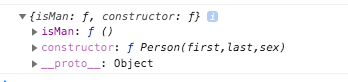

## JavaScript Object
  > Trong Javascript, đối tượng là vua. Nếu bạn hiểu về đối tượng, bạn sẽ hiểu về JavaScript
 - Mọi thứ trong JS đều biểu diễn dưới dạng một đối tượng
    + Booleans, Numbers, String có thể là đối tượng nếu định nghĩa với new từ khóa
    + Dates, Maths, Regular expressions, Arrays, Functions, Objects là đối tượng trong javascript
    + Ngoại trừ biến nguyên thủy (primitives) thì tất cả các giá trị trong javascript đều là 1 đối tượng
 #### 1. Biến nguyên thủy (Primitives)
   - A primitive là 1 giá trị không có các thuộc tính, không có hàm
   - A primitive data type là dữ liệu có giá trị nguyên thủy
    Javascript định nghĩa 5 loại của kiểu dữ liệu nguyên thủy: 
        + ```String```
        + ```number```
        + ```boolean```
        + ```null```
        + ```undefined```
   
   Các giá trị nguyên thủy là không thể thay đổi (nó được mã hóa cứng, do đó không thể thay đổi)
   > Ví dụ, nếu khai báo biến x = 3.14, lúc này bạn có thể thay đổi giá trị của X, nhưng không thể thay đổi giá trị 3.14
 #### 2. Biến đối tượng (Object Variables)    
   - Biến trong javascript có thể chứa 1 giá trị đơn
   ```javascript
var person = "Thieu Le Quang"
``` 
   - Nhưng cũng có thể chứa nhiều giá trị trong 1 biến
   ```javascript
   var person = {firstName: 'Thieu', lastName: 'Le', age: 18, eyeColor: 'blue'}
 ```
 => Đây là biến đối tượng
#### 3. Thuộc tính của đối tượng (Object properties)
  Vậy javascript object là 1 biến chứa các biến khác được đặt tên. Các biến được đặt tên trong đối tượng gọi là Object Properties
  > như ví dụ trước, firstName, lastName, age, eyeColor là các object properties của object person
#### 4. Object Methods
 - Object Methods là các action được thực thi trong 1 đối tượng 
 - Object properties có thể chứa các giá trị nguyên thủy (primitive values), các đối tượng khác (other objects), hoặc các (methods) hàm thực thi
```javascript
    var person = {
        firstName: 'Thieu',
        lastName: 'Le',
        age: 18,
        eyeColor: 'blue',
        fullName: function () { 
         return this.firstName + ' ' + this.lastName; 
       }
     }
```
 => Trong ví dụ trên, fullName là một object methods
> JavaScript objects chứa các giá trị được đặt tên (biến), gọi chung là properties và methods.
#### 5. Khởi tạo 1 JS Object
 - Có 4 cách để khởi tạo 1 object trong JS
     * Định nghĩa và khởi tạo 1 single object, sử dụng cách khai báo trực tiếp (object literal)
        ```javascript
        var person = {firstName: 'Thieu', lastName: 'Le', age: 18, eyeColor: 'blue'}
        ```
     * Định nghĩa và khởi tạo 1 single object, sử dụng từ khóa ```new```
        ```javascript
        var person = new Object();
        person.firstName = "Thieu";
        person.lastName = "Le";
        person.age = 18;
        person.eyeColor = "blue";
        ```
     * Định nghĩa 1 object constructor trước, và sau đó tạo objects thông qua constructed type
     ```javascript
        function Person(first, last, age, eye) {
          this.firstName = first;
          this.lastName = last;
          this.age = age;
          this.eyeColor = eye;
        }
       var myFather = new Person("Thieu", "Le", 18, "blue");
    ```
     * Tạo một object thông qua hàm ```Object.create()```
     ```javascript
           const person = {
               fullName: function () { 
                        return this.firstName + ' ' + this.lastName;   
               }
             };
           const me = Object.create(person);
             me.firstName = "Thieu";
             me.lastName = 'Le';
             me.fullName();//print Thieu Le
   ```
     > Trong ECMAScript 5, and object can also be created with the function ```Object.create()```
## Object Properties
  > Properties are the most important part of any JavaScript object.
 - Properties là những giá trị được gán cho 1 đối tượng trong JS
 - Một Object JS là một tập hợp các properties không sắp xếp
 - Properties có thể thường xuyên được thay đổi, thêm mới, và deleted, nhưng cũng có trường hợp readonly
 #### 1. Truy cập một Javascript Properties
   - Có 3 cách truy cập vào một properties
      * objectName.property, ví dụ : ```person.age```
      * objectName['property'], ví dụ: ```person["age"]```
      * objectName[expression], ví dụ: ```x = "age"; person[x]```
   - Access to all properties of object
  ```javascript
    var person = { fName:"Thieu", lName:"Le", age:18 };
    
    for (x in person) {
      txt += person[x];
    }
```
#### 2. Thêm mới một properties
  - Bạn có thể tạo mới một properties và gán giá trị cho nó trên một object đã tồn tại
  ````javascript
person.nationality = "English";
````
  - Ví dụ trên, nếu nationallity properties đã tồn tại, nó sẽ thay đổi giá trị, nếu chưa tồn tại, thì sẽ tạo mới một nationality properties và gán giá trị là English
#### 3.  Deleting Properties
   - Xóa một properties sử dụng từ khóa ```delete```, ví dụ: 
   ```javascript
var person = {firstName: "Thieu", lastName: "Le", age: 18, eyeColor: "blue"};
delete person.age;   // or delete person["age"];
```
## Object Methods
> Methods là action được thực thi trong đối tượng
> Methods cũng được lưu trữ như một Object properties
 ```javascript
 var person = {
   firstName: "Thieu",
   lastName : "Le",
   id       : 1,
   fullName : function() {
     return this.firstName + " " + this.lastName;
   }
 };
 ```
 - Gọi hàm follow theo cấu trúc ```objectName.methodName()```
 - Ví dụ trên có thể gọi hàm bằng cách ```person.fullName();```
 - Có thể định nghĩa 1 hàm vào object: 
 ```javascript
 person.name = function () {
   return this.firstName + " " + this.lastName;
 };
 ```
 ## Object Accessors (Getter and Setters)
 > Getters and Setters được giới thiệu từ ES5 (ECMAScript 5 (2009))
 > Get and Set cho phép định nghĩa Object Accessors (Computed Properties)
 - Hầu hết các ngôn ngữ lập trình đều có khái niệm get, set. Các hàm này dùng để thiết lập hoặc truy cập giá trị 1 properties của object.
 - Việc sử dụng get, set nhằm đảm bảo các truy cập properties đều phải thông qua hàm get và thiết lập gía trị phải thông qua hàm set
 ```javascript
// Create an object:
var person = {
  firstName: "Thieu",
  lastName : "Le",
  language : "",
  get lang() {
    return this.language;
  },
  set lang(lang) {
      this.language = lang;
  }
};
// Thực hiện hàm set
person.lang = 'en';
// thực hiện hàm get 
const lang = person.lang;
// giá trị của lang lúc này là 'en'
``` 
- Một trong những lợi ích của get, set là bảo mật dữ liệu các thuộc tính. Xem sét ví dụ sau đây :
```javascript
// Create an object:
var person = {
  firstName: "Thieu",
  lastName: "Le",
  t27101986: "en",
  get lang() {
    return this.t27101986.toUpperCase();
  },
  set lang(value) {
      this.t27101986 = value;
  }
};
// Thực hiện việc gán giá trị vào thuộc tính t27101987
// Nhìn bề ngoài sẽ ko biết được thực sự properties tên là gì
person.lang = 'en';
// Display data from the object using a getter:
const lang = person.lang;
// output lang is EN (upper case value)
```
#### Validation with Set 
- Xem set ví dụ dưới đây: 
```javascript
let user = {
  get name() {
    return this._name;
  },

  set name(value) {
    if (value.length < 4) {
      alert("Name is too short, need at least 4 characters");
      return;
    }
    this._name = value;
  }
};

user.name = "Thieu";
alert(user.name); // Thieu

user.name = ""; // Alert "Name is too short, need at least 4 characters"
```
- Ở ví dụ trên, đã check validate value trước khi set data vào thuộc tính _name. Giúp việc kiểm soát đầu vào các object an toàn hơn. 
- Đây là có vẻ là 1 ứng dụng khá hữu ích của get/set nhỉ ?

#### Object.defineProperties
- Ngoài ra, ta cũng có thể định nghĩa get, set thông qua cú pháp ```Object.defineProperties```, 
- Xem set ví dụ sau: 
```javascript
// Define object
var obj = {counter : 0};

// Define setters
Object.defineProperty(obj, "reset", {
  get : function () {this.counter = 0;}
});
Object.defineProperty(obj, "increment", {
  get : function () {this.counter++;}
});
Object.defineProperty(obj, "decrement", {
  get : function () {this.counter--;}
});
Object.defineProperty(obj, "add", {
  set : function (value) {this.counter += value;}
});
Object.defineProperty(obj, "subtract", {
  set : function (value) {this.counter -= value;}
});

// Play with the counter:
obj.reset;
obj.add = 5;
obj.subtract = 1;
obj.increment;
obj.decrement;
```
> Tóm lại, Why Using Getters and Setters?
 - It gives simpler syntax | Cú pháp đơn giản
 - It allows equal syntax for properties and methods | Cú pháp giống như properties và methods 
 - It can secure better data quality | Khả năng bảo mật code
 - It is useful for doing things behind-the-scenes | rất phù hợp phục vụ hậu trường, như validate, hoặc upper case như ví dụ ở trên.
## Object Constructors
  - Giống như đã nói ở phần trước, có nhiều cách để định nghĩa hoặc khởi tạo một đối tượng trong Javascript.
  - Một trong những cách đó là sử dụng hàm dựng. 
  ```javascript
function Person(first, last, age, eye) {
  this.firstName = first;
  this.lastName = last;
  this.age = age;
  this.eyeColor = eye;
  this.fullName = function () {
      return this.firstName + ' ' + this.lastName;
  };
}
```
  - Hàm Person là 1 hàm dựng, sử dụng để khởi tạo mới một hoặc nhiều object. 
  ```javascript
var myFather = new Person("Thieu", "Le", 18, "blue");
var myMother = new Person("Thao", "Vu", 19, "green");
``` 
 - Ví dụ trên tạo ra 2 object cùng loại. 
 - Điều này nói lên ý nghĩa của hàm dựng, tạo ra một khuôn mẫu cho các đối tượng được tạo ra.
 - Không giống như khái niệm class trong PHP hay Java, đối với JS, bạn hoàn toàn có thể định nghĩa riêng method cho mỗi instance của object.
 Xem sét ví dụ dưới:
 ```javascript
function Person(first, last, age, eye) {
  this.firstName = first;
  this.lastName = last;
  this.age = age;
  this.eyeColor = eye;
  this.fullName = function () {
      return this.firstName + ' ' + this.lastName;
  };
}
var myFather = new Person("Thieu", "Le", 18, "blue");
var myMother = new Person("Thao", "Vu", 19, "green");

//Define only for myFather object
myFather.playGame = function()
{
  return 'play game';
};
//call function in method constructor 
console.log(myFather.fullName());
console.log(myMother.fullName());

//call function definition for each object
console.log(myFather.playGame());
console.log(myMother.playGame());
```  
=> Output : 
``` 
    'Thieu Le'
    'Thao Vu'
    'play game'
    error: Uncaught TypeError: myMother.playGame is not a function
```
 - Có thể thấy, chỉ các method được định nghĩa trong constructor mới được sử dụng cho những object khởi tạo từ constructor đó. 
 - Đối với hàm ```playGame``` chỉ được định nghĩa riêng cho myFather object, nên nó bị lỗi nếu gọi từ myMother object.
## Javascript Prototype
- Tất cả các đối tượng trong JS đều kế thừa các thuộc tính, hàm từ prototype: 
    - ```Date``` objects kế thừa từ ```Date.prototype```
    - ```Array``` objects kế thừa từ ```Array.prototype```
    - ```Person``` objects kế thừa từ ```Person.prototype```
- ```Object.prototype``` là object cha cao nhất, ```Date``` objects, ```Array``` objects, and ```Person``` objects đều kế thừa từ ```Object.prototype```.
- Syntax sử dụng prototype: 
```javascript
function Person(first, last, sex) {
  this.firstName = first;
  this.lastName = last;
  this.sex = sex;
}
//Định nghĩa một hàm prototype
Person.prototype.isMan = function () {
    return this.sex == 'm';
};
let myFather = new Person("Thieu", "Le", "m");
let myMother = new Person("Thao", "Vu", "f");
console.log(myFather.isMan());
console.log(myMother.isMan());
```
=> Output
```
true
false
```
- Có thể xem object prototype của Person bằng cách
```javascript
console.log(Person.prototype); 
```  
=> Output



> Nội dung tham khảo từ https://www.w3schools.com