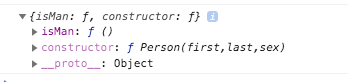

## Javascript Prototype
- Tất cả các đối tượng trong JS đều kế thừa các thuộc tính, hàm từ prototype: 
    - ```Date``` objects kế thừa từ ```Date.prototype```
    - ```Array``` objects kế thừa từ ```Array.prototype```
    - ```Person``` objects kế thừa từ ```Person.prototype```
- ```Object.prototype``` là object cha cao nhất, ```Date``` objects, ```Array``` objects, and ```Person``` objects đều kế thừa từ ```Object.prototype```.
- Syntax sử dụng prototype: 
```javascript
function Person(first, last, sex) {
  this.firstName = first;
  this.lastName = last;
  this.sex = sex;
}
//Định nghĩa một hàm prototype
Person.prototype.isMan = function () {
    return this.sex == 'm';
};
let myFather = new Person("Thieu", "Le", "m");
let myMother = new Person("Thao", "Vu", "f");
console.log(myFather.isMan());
console.log(myMother.isMan());
```
=> Output
```
true
false
```
- Có thể xem object prototype của Person bằng cách
```javascript
console.log(Person.prototype); 
```  
=> Output


